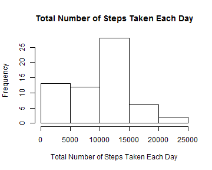
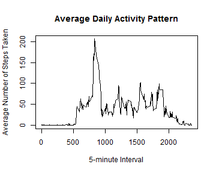
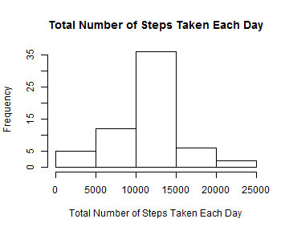
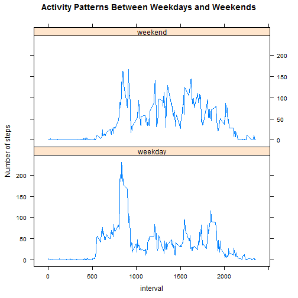

This is the R Markdown document for Reproducible Research Peer Assignment 1  
</br>  
  
## Loading and preprocessing the data


```r
data <- read.csv("activity.csv")
```
</br>  
  
## What is mean total number of steps taken per day?

Process the dataset to get total number of steps taken each day

```r
data1 <- tapply(data$steps, data$date, sum, na.rm = TRUE)
data1 <- data.frame(date = as.Date(names(data1)), tolsteps = as.integer(data1))
```

Make a histogram of the total number of steps taken each day

```r
hist(data1$tolsteps, main = "Total Number of Steps Taken Each Day", xlab = "Total Number of Steps Taken Each Day")
```

 

Calculate the mean and median of the total number of steps taken per day

```r
mean_step <- format(mean(data1$tolsteps), nsmall = 3)
median_step <- format(median(data1$tolsteps), nsmall = 3)
```
The **mean** of the total number of steps taken per day is **9354.230**  
The **median** of the total number of steps taken per day is **10395**   
</br>  
      
## What is the average daily activity pattern?

Process the dataset to get number of steps of the 5-minute interval on average across all the days

```r
data2 <- tapply(data$steps, as.factor(data$interval), mean, na.rm = TRUE)
data2 <- data.frame(interval = as.integer(names(data2)), avgsteps = as.numeric(data2))
```

Make a time series plot of the 5-minute interval and the average number of steps taken, averaged across all days

```r
plot(data2$interval, data2$avgsteps, type = "l", main = "Average Daily Activity Pattern", xlab = "5-minute Interval", ylab = "Average Number of Steps Taken")
```

 

Find out the 5-minute interval, on average across all the days in the dataset, contains the maximum number of steps

```r
interval_max_step <- data2$interval[data2$avgsteps == max(data2$avgsteps)]
```
The **interval** which contains the **maximum number of steps** is **835**  
</br>

## Imputing missing values

Calculate and report the total number of missing values in the dataset

```r
missing <- sum(is.na(data$steps))
```
The total **number of missing values** in the dataset is **2304**  

Create a new dataset that is equal to the original dataset but with the missing data filled in.  
Missing values filled in with the mean for that 5-minute interval.

```r
data3 <- merge(data, data2, by = "interval")
data3$steps[is.na(data3$steps)] <- data3$avgsteps[is.na(data3$steps)]
data3 <- data3[order(data3$date, data3$interval), 1:3]
```

Make a histogram of the total number of steps taken each day

```r
data4 <- tapply(data3$steps, data3$date, sum, na.rm = TRUE)
data4 <- data.frame(date = as.Date(names(data4)), tolsteps = as.numeric(data4))
hist(data4$tolsteps, main = "Total Number of Steps Taken Each Day", xlab = "Total Number of Steps Taken Each Day")
```

 

Calculate the mean and median of the total number of steps taken per day

```r
mean_step <- format(mean(data4$tolsteps), nsmall = 3)
median_step <- format(median(data4$tolsteps), nsmall = 3)
```
The **mean** of the total number of steps taken per day is **10766.189**  
The **median** of the total number of steps taken per day is **10766.189**  
These values differ from the estimates from the first part of the assignment.  
After imputing missing data, the total daily number of steps increases.  
</br>

## Are there differences in activity patterns between weekdays and weekends?

Create a new factor variable in the dataset with two levels -- "weekday" and "weekend" indicating whether a given date is a weekday or weekend day.

```r
data5 <- factor(weekdays(as.Date(data3$date)), levels = c("Monday", "Tuesday", "Wednesday", "Thursday", "Friday", "Saturday", "Sunday"), labels = c("weekday", "weekday", "weekday", "weekday", "weekday", "weekend", "weekend"))
data5 <- factor(data5)
data5 <- data.frame(data3, weekdays = data5)
```

Process the dataset to get number of steps of the 5-minute interval on average across all weekday days or weekend days.

```r
library(dplyr)
data6 <- group_by(data5, interval, weekdays)
data6 <- summarize(data6, avgsteps = mean(steps, na.rm = TRUE))
```

Make a panel plot containing a time series plot of the 5-minute interval and the average number of steps taken, averaged across all weekday days or weekend days. 

```r
library(lattice)
xyplot(avgsteps ~ interval | weekdays, data = data6, layout = c(1,2), type = "l", ylab = "Number of steps", main = "Activity Patterns Between Weekdays and Weekends")
```

 
